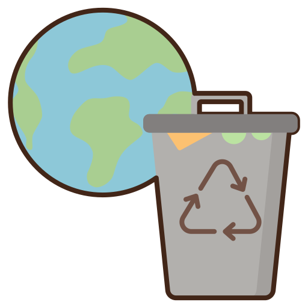

<h1 align="center" style='backgorund: black'>
<!--      -->
♻️  CYCLO ♻️
</h1>


<!-- <h3 align="center"> 
	Status: finished :heavy_check_mark:
</h3> -->

<p align="center">


</p>

## 📋 Index

- [About](#-about)
- [Technologies](#-technologies)
- [How To Use](#-how-to-use)
- [Author](#-author)
<!-- - [License](#-license) -->

## ⏱ About

**CYCLO** is a web application that allows users to use to connect with restaurants that have registered as a collection point for recyclable, organic or electronic waste. Which means that the user will be able to encourage local sustainable enterprises and correctly dispose of their garbage.

 
 
 
## 🤖 Technologies

The project was developed using this technologies:

- [React.js](https://reactjs.org/)
- [React Router](https://reactrouter.com/)
- [TypeScript](https://www.typescriptlang.org/)
- [CSS3](https://developer.mozilla.org/pt-BR/docs/Web/CSS)
- [SASS](https://sass-lang.com/)
- [Google Maps API](https://mapsplatform.google.com/)
- [Axios](https://axios-http.com/docs/intro)
- [Node.js](https://nodejs.org/en/)
- [SQLite](https://sqlite.org/index.html)


## ⚙ How to Use

```bash
# Clone this repository

$ git clone https://github.com/TatianaFischer/igti-final-degree-project.git


# Enter the project folder

$ cd projeto-aplicado-igti

1. Back-end with Node.js:

# Install the dependencies

$ npm install or yarn install

# Start the project

$ npm dev or yarn dev

2. Front-end with react:

# Install the dependencies

$ npm install or yarn install

# Start the project

$ npm start or yarn start

# Access the app

http://localhost:3000

```
<!-- 
## 🔬 Running Tests

```bash
$ npm run test
``` -->

## 👨‍🚀 Author

**Tatiana Fischer**

- GitHub: [@TatianaFischer](https://github.com/TatianaFischer)
- LinkedIn: [@tatianaffischer](https://www.linkedin.com/in/tatianaffischer/)

<!-- ## 📝 License

This project is under the [MIT](./LICENSE) license. -->

---

Developed with 💜 by Tatiana Fischer!
